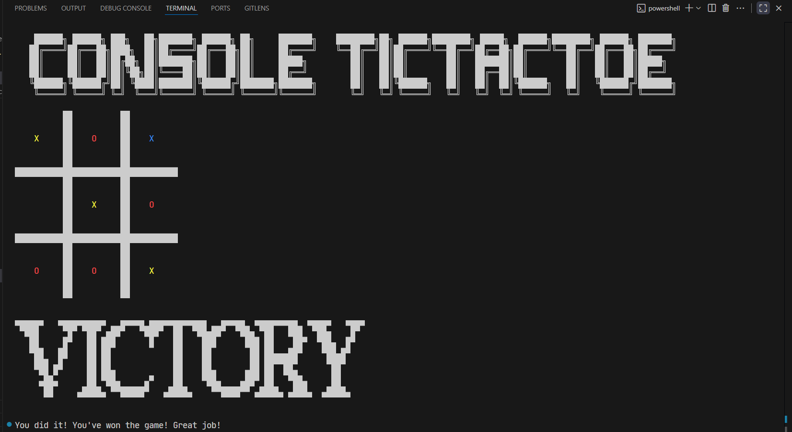

# 🎮 TicTacTerm++
⚠️ This project uses Windows API and currently only runs on Windows.

A terminal-based Tic Tac Toe game written in modern C++  featuring ASCII art, a basic AI (Minimax), and plans for PvP and sound support!

---

## Features

- Single Player (Player vs AI)
- Really bad AI 
- ASCII art title screens and endgame messages
- Smarter AI every move
- Keyboard input in terminal
- PvP mode (coming soon)
- Sound effects (coming soon)

---

##  How to Play

- Launch the game from the terminal in fullscreen mode to ensure proper display of the ASCII art.
- Choose your game mode (PvE available now, PvP coming soon)
- Pick your moves by entering row or column (e.g., `1 to 9`)
- Try to beat the AI or force a tie!

---

## 🛠️ Installation

1. **Clone the repo**

```bash
git clone https://github.com/gtRZync/TicTacTermpp.git
cd TicTacTermpp
````

2. **Run**

```bash
make run
```

---

## 📦 Dependencies

* C++17 or later
* Standard Terminal (Windows only)

---

##  Roadmap

* [x] Basic game loop (PvE)
* [ ] Minimax AI
* [x] ASCII UI
* [ ] PvP support
* [ ] Sound effects
* [ ] Difficulty levels for AI
* [ ] Better UI/UX polish

---

##  Images 

| Start Screen                                                                        |
|-------------------------------------------------------------------------------------|
|                                                             |
---------------------------------------------------------------------------------------
| Game in progress                           |  Tie                                   |
|--------------------------------------------|----------------------------------------|
|            |                  |
---------------------------------------------------------------------------------------
| Victory                                    | Defeat                                 |
|--------------------------------------------|----------------------------------------|
|              |            |


---

## 📄 License

MIT License — [LICENSE](LICENSE)

---